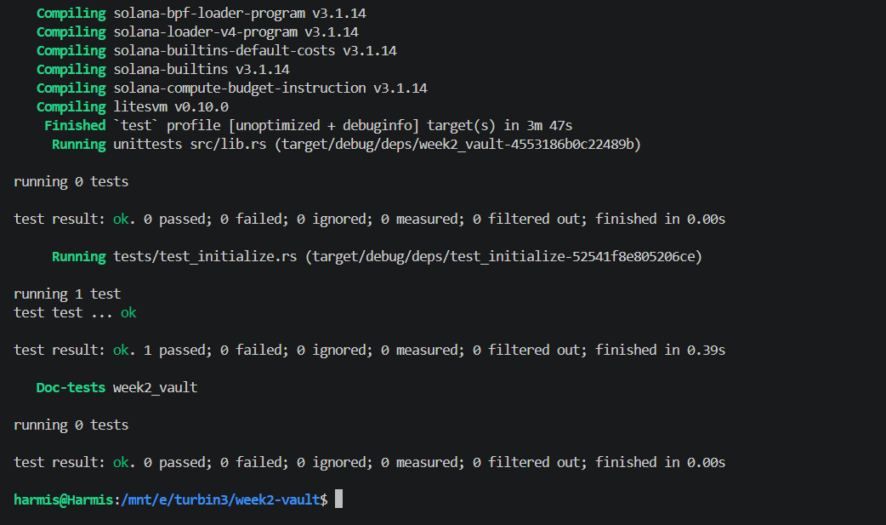

# Solana Native SOL Vault Program

A secure, non-custodial SOL vault program built on Solana using the Anchor framework. The program enables individual users to initialize isolated Program Derived Address (PDA) vaults for depositing, withdrawing, and closing vaults while maintaining full control over their funds.

---

## Overview

The Vault program provides deterministic, per-user account isolation:

1. **Initialization**: Creates a dedicated state account and funds a system-owned PDA vault with rent-exempt lamports.
2. **Deposit**: Transfers SOL from the user's wallet directly into their vault PDA via CPI to the Solana System Program.
3. **Withdraw**: Transfers requested SOL from the vault PDA back to the user's wallet using PDA signer seeds.
4. **Close**: Drains all remaining lamports from the vault PDA to the user and closes the state account to recover all rent.

---

## Program Details

- **Program ID**: `aNksHVU3gU1mjCPtTBsVk9S7qokAUvXfotB2jBxQQvv`
- **Framework**: Anchor (Rust)
- **Asset**: Native SOL (Lamports)

---

## Account Architecture & State

### 1. Vault State (`VaultState`)

Stores PDA bumps for deterministic signature verification and account resolution.

| Field | Type | Description |
| :--- | :--- | :--- |
| `vault_bump` | `u8` | Canonical bump seed for the vault PDA |
| `state_bump` | `u8` | Canonical bump seed for the state PDA |

### 2. PDA Derivation

- **Vault State PDA**:
  ```text
  seeds = [b"state", user_pubkey.as_ref()]
  ```
- **Vault System Account PDA**:
  ```text
  seeds = [b"vault", user_pubkey.as_ref()]
  ```

---

## Instructions

### 1. `initialize`

Initializes the user's `VaultState` account and transfers the minimum rent-exempt balance from the user to the vault PDA.

- **Parameters**: None
- **Signer**: User
- **CPI**: `system_program::transfer` for initial rent exemption

### 2. `deposit`

Deposits a specified amount of native lamports from the user's wallet into the vault PDA.

- **Parameters**: `amount: u64`
- **Signer**: User
- **Validation**: Requires `amount > 0` (`ErrorCode::InvalidAmount`)

### 3. `withdraw`

Withdraws a specified amount of native lamports from the vault PDA to the user's wallet.

- **Parameters**: `amount: u64`
- **Signer**: User
- **Authority**: Vault PDA signed via `[b"vault", user_pubkey, &[vault_bump]]`
- **Validation**: Requires `amount > 0` (`ErrorCode::InvalidAmount`)

### 4. `close`

Drains all remaining lamports from the vault PDA to the user and closes the `VaultState` account, returning all rent to the user.

- **Parameters**: None
- **Signer**: User
- **Authority**: Vault PDA signed via `[b"vault", user_pubkey, &[vault_bump]]`

---

## Project Structure

```text
week2-vault/
├── Anchor.toml
├── Cargo.toml
├── proof/
│   └── image.png               # LiteSVM test verification output
└── programs/
    └── week2-vault/
        ├── Cargo.toml
        ├── src/
        │   ├── lib.rs                  # Program entrypoint & module definitions
        │   ├── state.rs                # VaultState account struct
        │   ├── constants.rs            # Seed constants (STATE, VAULT_SEED)
        │   ├── error.rs                # Custom error definitions
        │   └── instructions/
        │       ├── mod.rs
        │       ├── initialize.rs       # Vault & state initialization
        │       ├── deposit.rs          # SOL deposit handler
        │       ├── withdraw.rs         # SOL withdraw handler (PDA signed)
        │       └── close.rs            # Vault close & balance refund
        └── tests/
            └── test_initialize.rs      # LiteSVM integration test suite
```

---

## Building and Testing

### Prerequisites

- Rust `1.75.0+`
- Solana CLI `1.18+`
- Anchor CLI `0.30.1`

### Build

```bash
anchor build
```

### Test

Integration testing is implemented using `litesvm` to execute full transaction cycles against the compiled SBPF program binary.

```bash
cargo test --package week2-vault
```

### Test Flow

The test suite validates:
1. `Initialize`: Verifies `VaultState` creation and initial rent-exempt balance allocation.
2. `Deposit`: Verifies lamport transfer from user to vault PDA.
3. `Withdraw`: Verifies PDA-signed withdrawal and balance reduction.
4. `Close`: Verifies total vault liquidation, state account deletion, and rent reclamation.

---

## Execution & Test Proof

Integration tests executed successfully against the program binary via LiteSVM:


